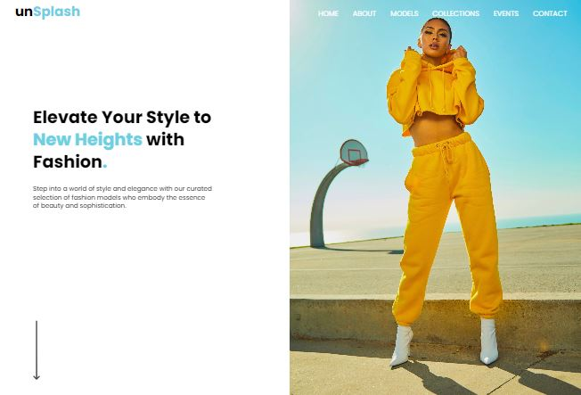
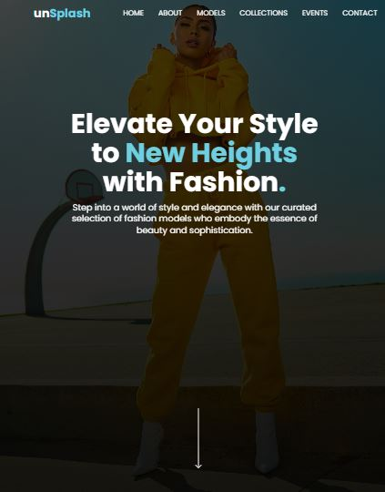
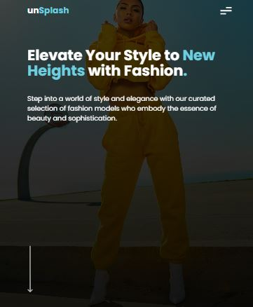
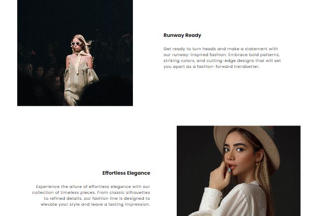
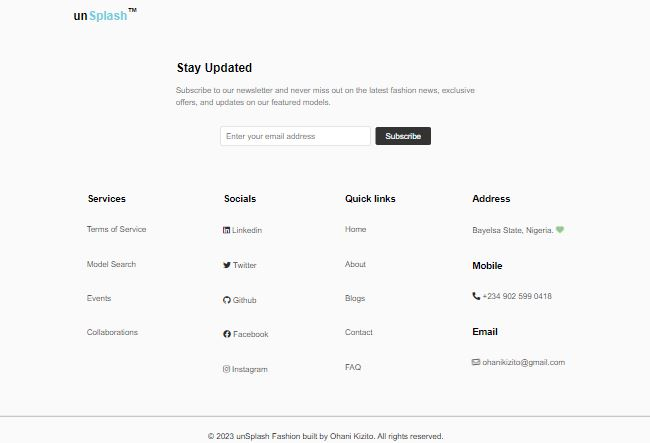
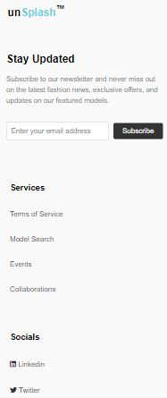

# unSplash Fashion Model Website

This is a responsive website template for a fashion model website called unSplash. It includes HTML, SCSS, and JavaScript code to create a modern and visually appealing layout.

## Screenshots







## Link 

Live link: [here](https://unsplash-fashion.netlify.app/)

## Features

- Responsive design
- Hamburger menu for mobile navigation
- Hero section with captivating image and text content
- Feature grid showcasing different fashion styles
- Subscribe section with a newsletter subscription form
- Footer section with various links and contact details

## Technologies Used

- HTML
- SCSS (CSS preprocessor)
- JavaScript

## Usage

1. Clone the repository:

```
git clone https://github.com/your-username/unSplash-fashion-website.git
```


2. Open the `index.html` file in a web browser.

## Customization

- Replace the images in the `assets/images` directory with your own images.
- Update the text content in the HTML file to match your requirements.
- Customize the styles in the SCSS file `styles/main.scss` to change the visual appearance of the website.
- Modify the JavaScript code in the `app.js` file to add or modify functionality as needed.

## Credits

- The website template was created by [Ohani Kizito](https://github.com/kizitech).


## Author

- LinkedIn - [Ohani Kizito](https://www.linkedin.com/in/ohanikizito/)
- Twitter - [Ohani_Kizito](https://www.twitter.com/Ohani_Kizito)
